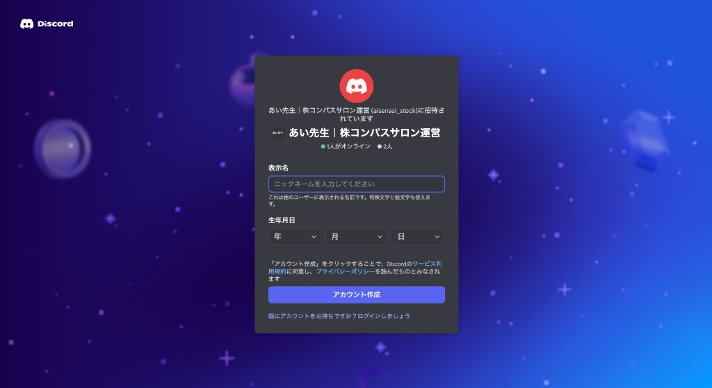
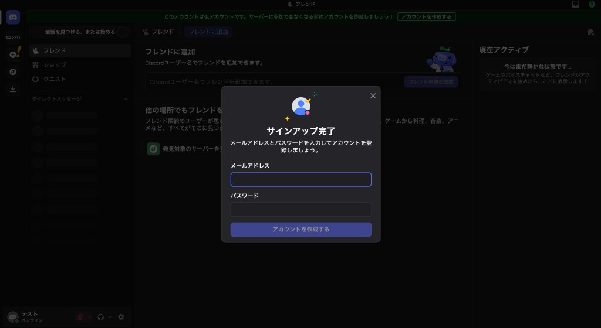
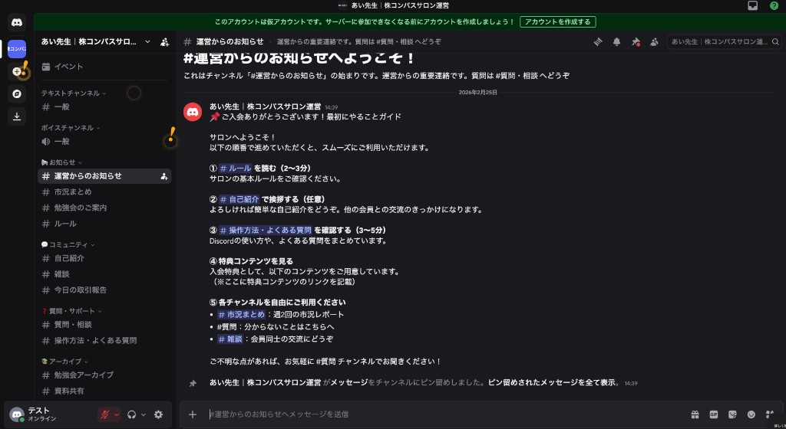

# Discord参加ガイド（図解版）

> 初めてDiscordをお使いの方向けに、参加方法を図付きで解説します。

---

## 🚀 STEP 1: 招待リンクをクリック

入会完了メール（またはLINE）に記載されている招待リンクをクリックします。

**招待リンク**: https://discord.gg/ez8rbXU6

すると、以下のような画面が表示されます。

### この画面で入力すること

| 項目 | 入力内容 |
|------|----------|
| **表示名** | サロン内で表示される名前（ニックネームでOK） |

入力したら「**アカウント作成**」ボタンをクリックします。

> 💡 **すでにDiscordアカウントをお持ちの方**  
> 画面下部の「既にアカウントをお持ちですか？ログインしましょう」をクリックしてログインしてください。

---

## 🔐 STEP 2: アカウント情報を入力

次に、アカウント作成の画面が表示されます。

### 入力する内容

| 項目 | 入力内容 |
|------|----------|
| **メールアドレス** | 普段お使いのメールアドレス |
| **パスワード** | 8文字以上で設定 |

入力したら「**アカウントを作成する**」ボタンをクリックします。

> ⚠️ **注意**  
> 登録したメールアドレスに確認メールが届きます。メール内のリンクをクリックして認証を完了してください。

---

## ✅ STEP 3: サロンに参加完了！

認証が完了すると、サロンのサーバーに入れます。  
以下のような画面になれば参加成功です！

---

## 📺 画面の見方

参加後の画面について説明します。

### 左側：チャンネル一覧

画面左側に表示されているのが「チャンネル」です。  
話題ごとに部屋が分かれています。

| カテゴリ | チャンネル名 | 内容 |
|----------|--------------|------|
| **📢 お知らせ** | #運営からのお知らせ | 運営からの重要連絡（読むだけ） |
| | #市況まとめ | 週2回の市況レポート（読むだけ） |
| | #勉強会のご案内 | 勉強会の告知 |
| | #ルール | サロンのルール |
| **💬 コミュニティ** | #自己紹介 | メンバーの自己紹介 |
| | #雑談 | 自由な交流 |
| | #今日の取引報告 | 取引報告の共有 |
| **❓ 質問・サポート** | #質問・相談 | 投資に関する質問 |
| | #操作方法・よくある質問 | Discordの使い方 |
| **📚 アーカイブ** | #勉強会アーカイブ | 過去の勉強会録画 |
| | #資料共有 | 配布資料 |

### 真ん中：メッセージ表示エリア

選択したチャンネルの内容が表示されます。

### 下部：メッセージ入力欄

ここにメッセージを入力してEnterキーで送信できます。  
（※読み取り専用のチャンネルでは入力できません）

---

## 🎯 最初にやること

サロンに参加したら、以下の順番で進めてください。

### ① #ルール を読む（2〜3分）
サロンの基本ルールをご確認ください。

### ② #自己紹介 で挨拶する（任意）
よろしければ簡単な自己紹介をどうぞ。  
他の会員との交流のきっかけになります。

### ③ #操作方法・よくある質問 を確認する（3〜5分）
Discordの使い方や、よくある質問をまとめています。

### ④ 特典コンテンツを見る
#運営からのお知らせ に、入会特典のご案内があります。

### ⑤ 各チャンネルを自由にご利用ください
- **#市況まとめ**：週2回の市況レポート
- **#質問・相談**：分からないことはこちらへ
- **#雑談**：会員同士の交流にどうぞ

---

## ❓ よくあるトラブル

### Q. 招待リンクが開けない

→ Discordアプリをダウンロードしてから、アプリ内で参加してください。

**アプリのダウンロード**
- PC版: https://discord.com/download
- iOS: App Storeで「Discord」を検索
- Android: Google Playで「Discord」を検索

アプリを開いたら、左側の「＋」ボタン → 「サーバーに参加」から招待リンクを貼り付けてください。

### Q. メール認証ができない

→ 迷惑メールフォルダをご確認ください。  
Discord（noreply@discord.com）からのメールが届いているはずです。

### Q. メッセージが送れない

→ 「読み取り専用」のチャンネル（#お知らせなど）では書き込みできません。  
#雑談 や #質問・相談 でお試しください。

---

## 🆘 困ったときは

操作方法でわからないことがあれば、  
**#質問・相談** チャンネルでお気軽にご質問ください！

運営スタッフがサポートします。

---

## 更新履歴

| 日付 | 内容 | 担当 |
|------|------|------|
| 2026/02/25 | 初版作成（スクリーンショット付き） | 小谷 |
